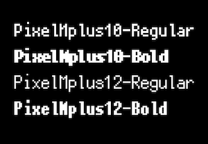

# PixelMplus

## Installation

### CocoaPods

```
# Podfile
target 'YourProject' do
  use_frameworks!
  pod 'PixelMplus'
end

$ pod install
```

## Getting Started

```
import PixelMplus

label.font = UIFont(name: PixelMplus.regular10, size: 20.0)
```

## Example

```
$ bundle
$ cd Example
$ bundle exec pod install
$ open Example.xcworkspace
```



## License

M+ FONTS LICENSE
